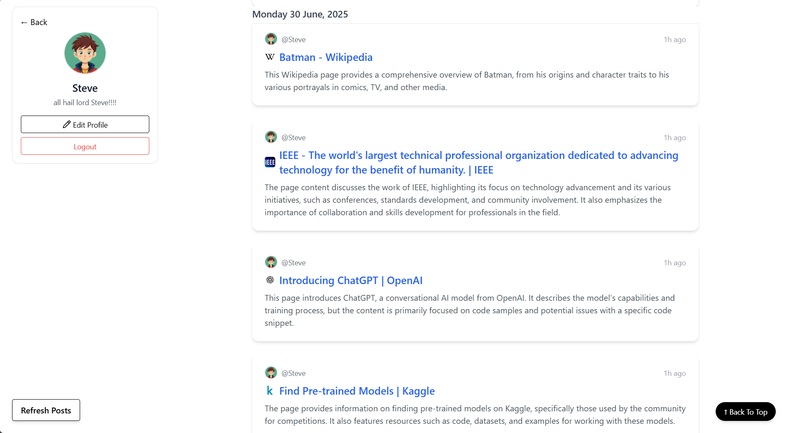
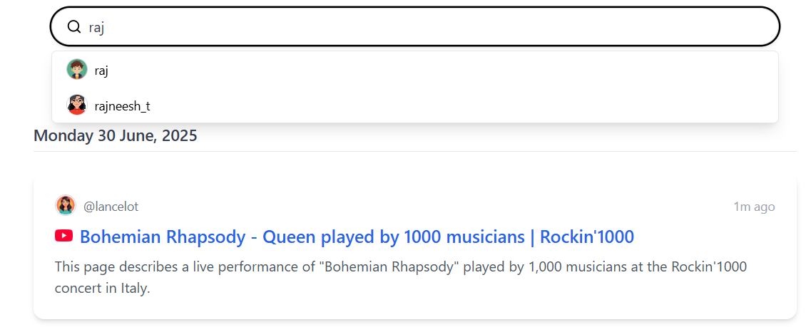
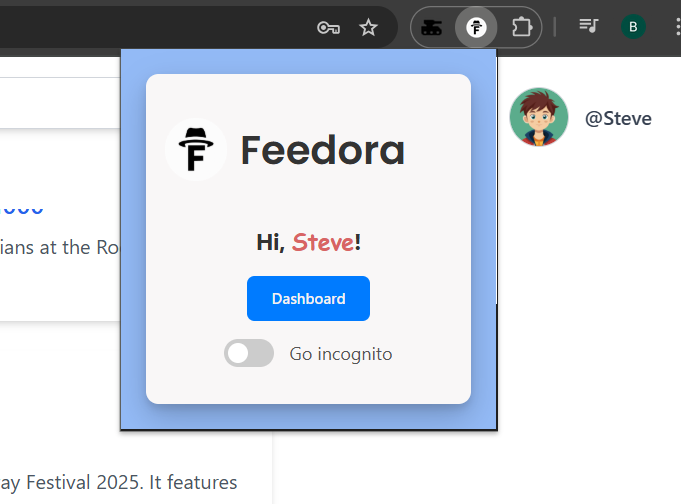

#  Readinglist-Watchlist Website Extension (RLW)

The **Readinglist-Watchlist Website Extension (RLW)** is a powerful personal content management platform that helps you track, group, and share your reading and watchlist activities. The project consists of a React + Tailwind frontend, a Django + DRF backend, and a browser extension for convenient content capturing.

With RLW, you can manage books, articles, and videos seamlessly — from anywhere, at any time.

---

##  Features

✅ JWT-based authentication  
✅ User search with suggestions  
✅ Infinite scrolling for posts  
✅ Group posts by date  
✅ Profile pages with user posts  
✅ Automatic post summarization using local LLM (Gemma-2-2B-it-Q6_K)  
✅ Background tasks using Celery + Redis  
✅ Cloudflared tunnel integration for secure local testing  
✅ Responsive and clean UI  
✅ Browser extension for quick captures  

---

##  Screenshots

**Home Page**  

**User Profile**  

**Search with Suggestions**  

**Extension Popup**  

**Edit Profile**
!(https://github.com/uranaveer/Readinglist-Watchlist-website_extension/blob/main/images/editprofile-img.png)

---

# Project Setup  
For detailed project setup instructions, please refer to the respective README files in each folder:

→ [Frontend setup](https://github.com/uranaveer/Readinglist-Watchlist-website_extension/blob/main/Frontend/README.md)  
→ [Server setup](https://github.com/uranaveer/Readinglist-Watchlist-website_extension/blob/main/server/README.md)

